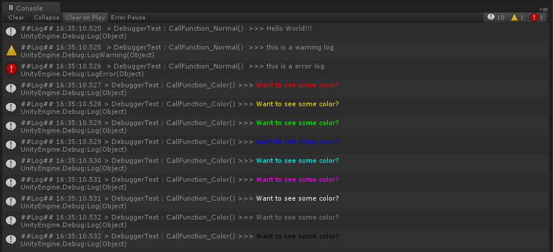

# Unity Tricks

Some Unity tricks, helpful in my work. Most is collected from anywhere.  
一些Unity的小技巧，从各个角落收集而来。

## 01 Unity Debugger
* **简介**  
对Unity `Debug.Log` 的封装，同时显示输出时间，输出语句所在的函数，并可以改变输出的颜色。  

<<<<<<< HEAD

=======
>>>>>>> ba6f8d09a866b63d6902495c80781646a56cce5d

* **直接使用**  
    1. 把 DLL 文件放到Unity工程中，在 `Player Setting - Other Settings - Scripting Define Symbols` 中，添加 `ENABLE_LOG` 。
    2. 在需要输出Log的地方，通过 `this.Log()` 调用函数（添加`UnityUtilities`命名空间），如果要显示指定颜色的输出，使用 `this.Log("log", Color.cyan)` 语句。
* **更新**  
2018/02/09：第一版  
2018/04/18：修改了 `this.Warn()` 和 `this.Error()` 输出显示错误的问题  
* **参考文章**  
http://www.sunjiahaoz.com/archives/1266

## 02 Text Spacing
* **简介**  
UGUI的Text组件中没有修改字间距的参数，于是找了一个方法，通过修改字体的Mesh调整Text的字间距。  
虽然免费插件 `TextMesh Pro` 有这个功能，但是这个插件有20m（不知道打包之后多大），感觉只为了这一个小功能有点浪费（摊手）。
* **直接使用**  
    1. 把Script放到Unity工程中，在带有Text组件的GameObject上添加 `TextSpacing` 组件。
    2. 在Editor中修改 `TextSpacing` 参数。
* **注意**  
    * 未知
* **更新**  
2018/05/28：第一版 
* **参考文章**  
https://blog.csdn.net/qq_26999509/article/details/51902551

### Working Stuff
#### 1. Unity Align & Rename 
可以把 `Hierarchy` 中的选中多个物体或者某个物体的子物体按照 `rect` 组件的高度，上下对齐排列  
Ps：功能尚未完善
